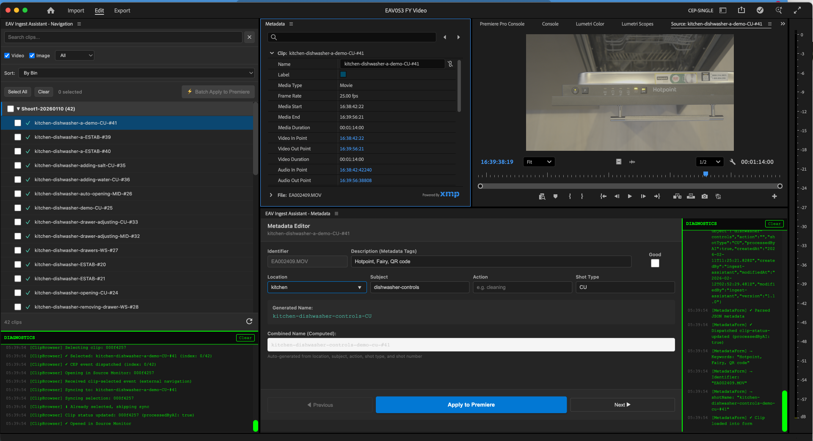

# EAV Ingest Assistant - CEP Panel

Adobe CEP extension for Premiere Pro that streamlines video/image metadata tagging with structured naming and XMP integration.

## Overview

Two-panel system that integrates directly into Premiere Pro:
- **Navigation Panel** (bottom) - Browse and select clips with search/filter
- **Metadata Panel** (right) - Edit structured metadata with live preview

Works seamlessly with [Ingest Assistant](https://github.com/elevanaltd/ingest-assistant) for AI-powered metadata generation before import.



---

## Features

### ✅ Current (v1.0)

**Navigation Panel:**
- Clip browser with thumbnails
- Search and filter (video/image/tagged)
- Click to load in Metadata Panel
- Auto-open in Source Monitor
- XMP metadata preview

**Metadata Panel:**
- Structured naming: `{location}-{subject}-{action}-{shotType}`
- Form fields: Location, Subject, Action, Shot Type, Description
- Live name preview
- XMP metadata read/write (`xmpDM:logComment`, `xmpDM:shotName`, `dc:description`)
- Previous/Next navigation
- Good/Bad flagging
- Diagnostics panel for debugging

**XMP Integration:**
- Reads metadata from Ingest Assistant
- Writes to proxy-safe XMP namespaces
- Survives proxy workflow
- Compatible with Adobe Bridge

---

## Installation

### Quick Start (macOS)

```bash
git clone https://github.com/elevanaltd/eav-cep-assist.git
cd eav-cep-assist
./install.sh
# Restart Premiere Pro
```

### Quick Start (Windows)

See detailed instructions: [INSTALL-WINDOWS.md](INSTALL-WINDOWS.md)

### Manual Installation

**macOS:** See `install.sh` for individual steps
**Windows:** See [INSTALL-WINDOWS.md](INSTALL-WINDOWS.md)

---

## Usage

### Basic Workflow

1. **Open both panels** in Premiere Pro:
   - Window → Extensions → **EAV Ingest Assistant - Navigation**
   - Window → Extensions → **EAV Ingest Assistant - Metadata**

2. **Arrange panels:**
   - Navigation: Bottom (horizontal strip)
   - Metadata: Right side (vertical form)

3. **Select a clip** in Navigation Panel
   - Auto-loads in Metadata Panel
   - Auto-opens in Source Monitor

4. **Edit metadata:**
   - Fill in: Location, Subject, Action, Shot Type
   - Add Description (metadata tags)
   - Preview generated name

5. **Apply to Premiere:**
   - Updates clip name in Project Panel
   - Writes XMP metadata to file
   - Metadata survives proxy creation

6. **Navigate:**
   - Use Previous/Next buttons
   - Or click clips in Navigation Panel

---

## Structured Naming Format

**Videos (with action):**
```
{location}-{subject}-{action}-{shotType}
Example: kitchen-oven-cleaning-CU
```

**Images / Static Shots:**
```
{location}-{subject}-{shotType}
Example: bathroom-sink-WS
```

**Shot Types:**
- `WS` - Wide shot
- `MID` - Mid shot
- `CU` - Close up
- `UNDER` - Underneath
- `FP` - Focus pull
- `TRACK` - Tracking shot
- `ESTAB` - Establishing shot

---

## XMP Metadata Fields

The panel writes to the following XMP fields:

| Field | XMP Path | Purpose |
|-------|----------|---------|
| **Shot Name** | `xmpDM:shotName` | Combined structured name (visible in PP Shot column) |
| **Log Comment** | `xmpDM:logComment` | Structured components: `location=X, subject=Y, action=Z, shotType=W` |
| **Description** | `dc:description` | Metadata tags (comma-separated) |
| **Identifier** | `dc:identifier` | Original filename/ID |

**Compatibility:**
- ✅ Reads from Ingest Assistant
- ✅ Survives proxy creation
- ✅ Compatible with Adobe Bridge
- ✅ Round-trip editing (CEP ↔ IA)

---

## Integration with Ingest Assistant

**Workflow:**
1. Process files in [Ingest Assistant](https://github.com/elevanaltd/ingest-assistant) (AI analysis)
2. IA writes XMP metadata to files
3. Import files to Premiere Pro
4. CEP panel auto-loads XMP metadata
5. Review/edit in CEP panel
6. Apply to Premiere Pro

**Related:** [Ingest Assistant Issue #54](https://github.com/elevanaltd/ingest-assistant/issues/54) - XMP Field Alignment

---

## Troubleshooting

### Panels don't appear in Window → Extensions

**Cause:** CEP Debug Mode not enabled

**Fix (macOS):**
```bash
defaults write com.adobe.CSXS.12 PlayerDebugMode 1
# Adjust .12 to match your PP version (see install.sh)
```

**Fix (Windows):**
See [INSTALL-WINDOWS.md](INSTALL-WINDOWS.md) - Registry edit required

### Panels appear but don't open

**Cause:** Premiere Pro needs restart after enabling debug mode

**Fix:**
1. Quit Premiere Pro completely (Cmd+Q / Alt+F4)
2. Reopen Premiere Pro
3. Try opening panels again

### Metadata not saving

**Cause:** File might be offline or read-only

**Fix:**
1. Check ExtendScript diagnostics in Metadata Panel (bottom area)
2. Look for errors like "File not found" or "Permission denied"
3. Verify file is online in Project Panel
4. Check file permissions

### Fields show "EMPTY" instead of metadata

**Cause:** XMP warm-up delay (1.5s) or file has no XMP

**Fix:**
1. Wait 2-3 seconds after loading Navigation Panel
2. Click clip again to reload
3. Check if file was processed by Ingest Assistant

---

## Development

### Project Structure

```
eav-cep-assist/
├── index-navigation.html       # Navigation panel UI
├── index-metadata.html         # Metadata panel UI
├── CSXS/
│   ├── manifest-navigation.xml # Navigation manifest
│   └── manifest-metadata.xml   # Metadata manifest
├── js/
│   ├── navigation-panel.js     # Navigation logic
│   ├── metadata-panel.js       # Metadata logic
│   └── CSInterface.js          # Adobe CEP API
├── jsx/
│   └── host.jsx                # ExtendScript (shared)
├── css/
│   ├── navigation-panel.css
│   └── metadata-panel.css
└── deploy-*.sh                 # Deployment scripts
```

### Deploy Changes

```bash
./deploy-navigation.sh  # Deploy Navigation panel
./deploy-metadata.sh    # Deploy Metadata panel
# Restart Premiere Pro
```

---

## Roadmap

### Future Features (See Issues)

- 🔲 Auto-apply XMP on import ([#13](https://github.com/elevanaltd/eav-cep-assist/issues/13))
- 🔲 Batch operations panel
- 🔲 Hot-folder watch integration
- 🔲 Keyboard shortcuts
- 🔲 Custom lexicon support

**AI Analysis:**
Investigated in [#12](https://github.com/elevanaltd/eav-cep-assist/issues/12) - Recommended to keep in Ingest Assistant due to architectural constraints.

---

## Contributing

1. Fork the repository
2. Create feature branch: `git checkout -b feature/my-feature`
3. Commit changes: `git commit -am 'Add feature'`
4. Push to branch: `git push origin feature/my-feature`
5. Submit Pull Request

---

## Version History

**v1.0.0** (2025-11-12)
- Two-panel system (Navigation + Metadata)
- XMP metadata read/write
- Ingest Assistant integration
- Structured naming with live preview
- Diagnostics panel
- Previous/Next navigation

---

**License:** MIT
**Author:** Elevana Development Team
**Repository:** https://github.com/elevanaltd/eav-cep-assist

---

## Need Help?

- **Issues:** https://github.com/elevanaltd/eav-cep-assist/issues
- **Ingest Assistant:** https://github.com/elevanaltd/ingest-assistant
- **Documentation:** See `CLAUDE.md` for technical details
